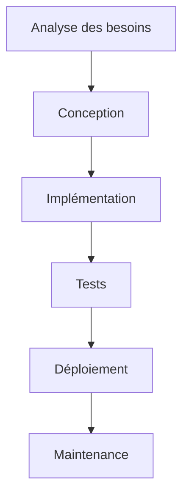

# Gestion de Projets

## Méthodologies et bonnes pratiques

---

## Introduction à la Gestion de Projets

- Processus structuré pour atteindre des objectifs spécifiques
- Équilibre entre contraintes : temps, coût, qualité
- Différentes méthodologies selon les contextes

Note: Commencer par demander à l'audience leur expérience en gestion de projet

--

## Le Triangle de la Gestion de Projet


Note: Expliquer que modifier une contrainte affecte les autres

--

## Objectifs de cette présentation

1. Explorer les principales méthodologies
2. Comprendre les phases d'un projet
3. Découvrir les outils essentiels
4. Examiner des cas pratiques

:::info Attentes
Cette présentation alterne théorie et exemples pratiques
:::

---

## Méthodologies de Gestion de Projet

--

## Méthodologie Waterfall (Cascade)



:::note Caractéristiques

- Phases séquentielles
- Documentation exhaustive
- Peu de changements en cours de route
  :::

Note: Mentionner que c'est adapté aux projets stables et bien définis

--

## Méthodologie Agile


:::tip Avantages

- Flexibilité face aux changements
- Livraisons fréquentes
- Implication constante des parties prenantes
  :::

Note: Insister sur l'importance de la communication dans Agile

--

## Comparaison des méthodologies

| Méthodologie | Flexibilité | Documentation | Implication client |
|--------------|-------------|---------------|--------------------|
| Waterfall    | Faible      | Exhaustive    | Début et fin       |
| Agile        | Élevée      | Progressive   | Continue           |
| Scrum        | Élevée      | Modérée       | À chaque sprint    |
| Kanban       | Très élevée | Minimale      | Continue           |

:::warning
Aucune méthodologie n'est universelle - adaptez selon le contexte !
:::

---

## Phases d'un Projet

--

## 1. Initialisation

```javascript
function defineProject() {
  const vision = "Ce que nous voulons accomplir";
  const scope = ["Objectifs", "Livrables", "Contraintes"];
  return createProjectCharter(vision, scope);
}
```

:::info
L'initialisation pose les bases du projet et définit sa viabilité
:::

Note: Insister sur l'importance du document de cadrage (Project Charter)

--

## 2. Planification

- Création de la structure de découpage du projet (WBS)
- Estimation des ressources nécessaires
- Élaboration du calendrier
- Identification des risques

:::danger Pièges à éviter

- Sous-estimer les délais
- Négliger la gestion des risques
- Planifier sans marge de manœuvre
  :::

--

## 3. Exécution

Transformation des plans en actions concrètes:

┌───────────────┐ ┌───────────────┐ ┌───────────────┐
│ Mobiliser │────>│ Coordonner │────>│ Produire │
│ les équipes │ │ les efforts │ │ les livrables │
└───────────────┘ └───────────────┘ └───────────────┘

Note: C'est la phase où le leadership est crucial

--

## 4. Suivi et contrôle

Techniques de suivi:

- Réunions d'avancement
- Tableau de bord (dashboards)
- Gestion de la valeur acquise (EVM)

:::success Indicateurs clés

- SPI (indice de performance du calendrier)
- CPI (indice de performance des coûts)
- Qualité des livrables
  :::

--

## 5. Clôture

- Acceptation formelle des livrables
- Documentation des leçons apprises
- Libération des ressources
- Célébration des succès!

Projet réussi = (Objectifs atteints) + (Équipe satisfaite) + (Client heureux)

Note: Ne jamais sous-estimer l'importance de la phase de clôture

---

## Outils de Gestion de Projet

--

## Diagramme de Gantt

gantt
title Exemple de diagramme de Gantt
dateFormat YYYY-MM-DD
section Phase 1
Tâche 1           :a1, 2023-01-01, 7d
Tâche 2           :a2, after a1, 5d
section Phase 2
Tâche 3           :a3, after a2, 10d
Tâche 4           :a4, after a3, 3d

:::info
Le diagramme de Gantt visualise le calendrier et les dépendances
:::

--

## Kanban Board


:::tip
Parfait pour visualiser le flux de travail et identifier les goulots d'étranglement
:::

Note: Montrer comment on peut utiliser des outils comme Trello ou Jira

--

## Outils collaboratifs

| Catégorie         | Exemples           | Utilité               |
|-------------------|--------------------|-----------------------|
| Communication     | Slack, Teams       | Échanges rapides      |
| Documentation     | Confluence, Notion | Base de connaissances |
| Gestion de tâches | Jira, Asana        | Suivi des tâches      |
| Diagrammes        | Miro, Lucidchart   | Visualisation         |

---

## Études de Cas

--

## Cas 1: Projet en retard

:::danger Situation
Un projet de développement logiciel est en retard de 3 mois sur un calendrier initial de 12 mois
:::

Solutions possibles:

1. Ajouter des ressources?
2. Réduire le périmètre?
3. Décaler la date de livraison?

Note: Citer la loi de Brooks: "Ajouter des développeurs à un projet en retard le retarde davantage"

--

## Cas 2: Changements constants

Client ───> Demande de changement ───> Équipe projet
^ │
│ │
└───────── Impact sur le projet ◄───────┘

:::warning
Les changements constants sont la principale cause d'échec des projets waterfall
:::

Solution: Méthodologie Agile avec:

- Sprints courts
- Révisions régulières
- Backlog priorisé

--

## Cas 3: Succès d'un projet complexe

:::success Exemple: Jeux Olympiques
Planification sur plusieurs années
Coordination de milliers d'intervenants
Délai non négociable
:::

Facteurs clés:

- Gouvernance claire
- Jalons bien définis
- Gestion proactive des risques
- Communication efficace

---

## Conclusion

--

## Principes universels

1. **Communiquer** clairement et régulièrement
2. **Documenter** les décisions importantes
3. **Adapter** la méthodologie au contexte
4. **Anticiper** les risques
5. **Célébrer** les succès

Note: Insister sur l'importance de l'humain dans la gestion de projet

--

## Questions?

:::info
N'hésitez pas à poser vos questions
:::


Note: Prévoir des questions alternatives si personne ne pose de question

---

## Ressources

- [Guide PMBOK](https://www.pmi.org/pmbok-guide-standards)
- [Manifeste Agile](https://agilemanifesto.org/iso/fr/manifesto.html)
- [Scrum Guide](https://scrumguides.org/index.html)
- [Kanban University](https://kanban.university/)

:::note
Ces ressources sont téléchargeables sur notre site web
:::